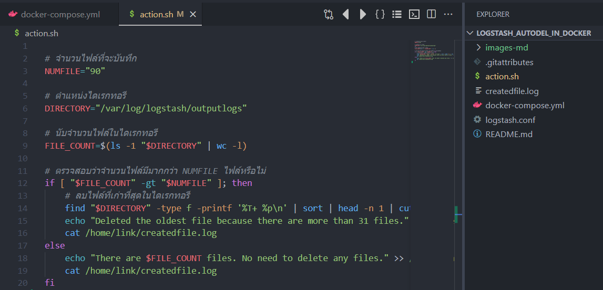
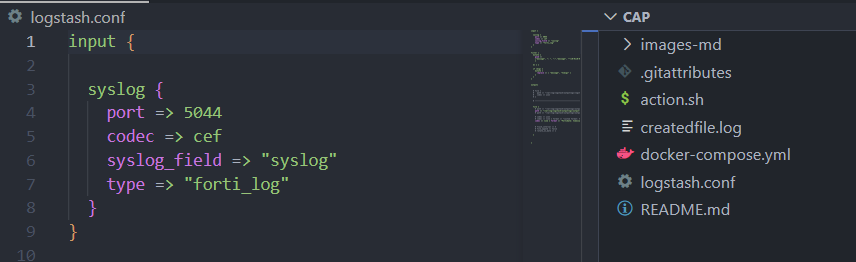
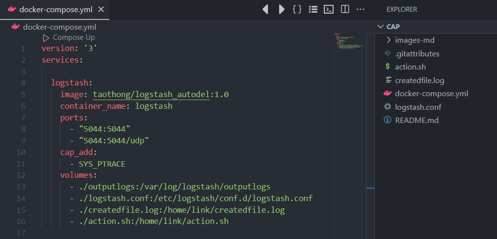

# How to install ?
   #### step 1 install docker and git
   
- sudo apt install docker -y 
- sudo apt install git -y 

#### step 2 clone project to your server

- git clone https://github.com/Taothong98/Logstash_Autodel_in_Docker.git 

#### step 3 run docker in project

- cd Logstash_Autodel_in_Docker
- sudo docker-compose up -d

# Check service
#### You can check whether container start with this command 

- sudo docker ps -a

# Config FortiGate for send log to logstash

####  command

- [ ] show log syslogd setting
- [ ] config log syslogd setting 
    - [ ] set port 5044
    - [ ] set format default
    - [ ] set server "200.0.0.200"
    - [ ] set status enable
	- [ ] end
	
	
#### Check you output in this dir

#### customs file

##### customs number of file in dir

##### customs port

	 and this file

	

# HA service	

	
	