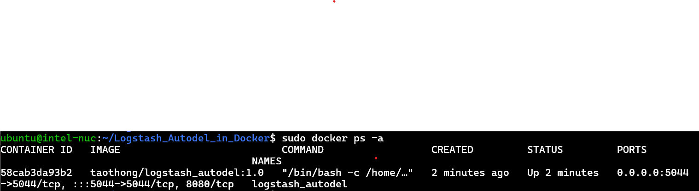
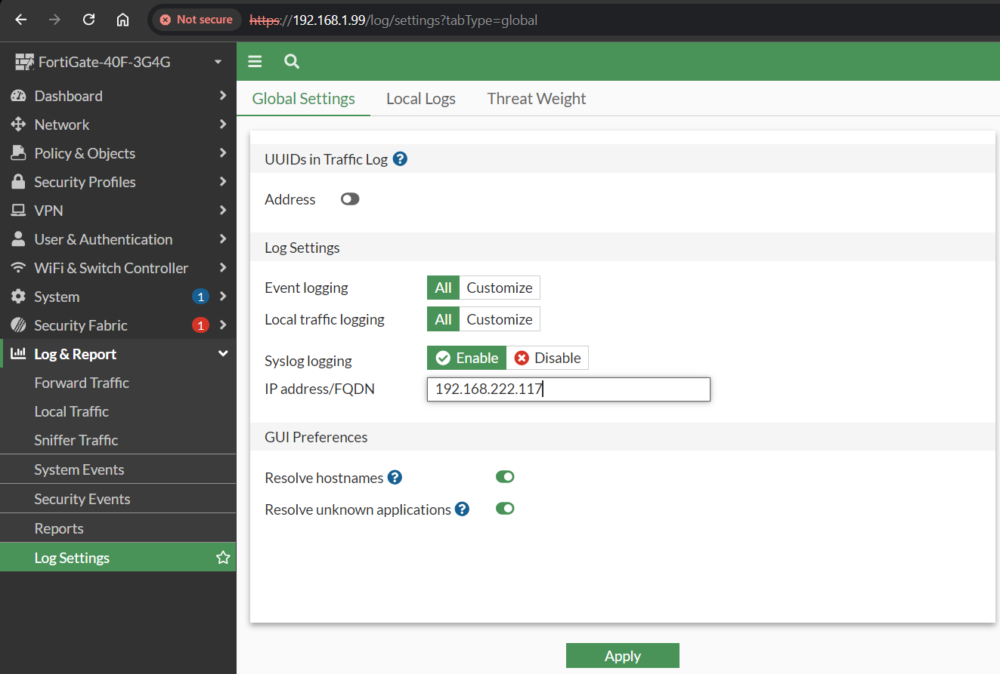
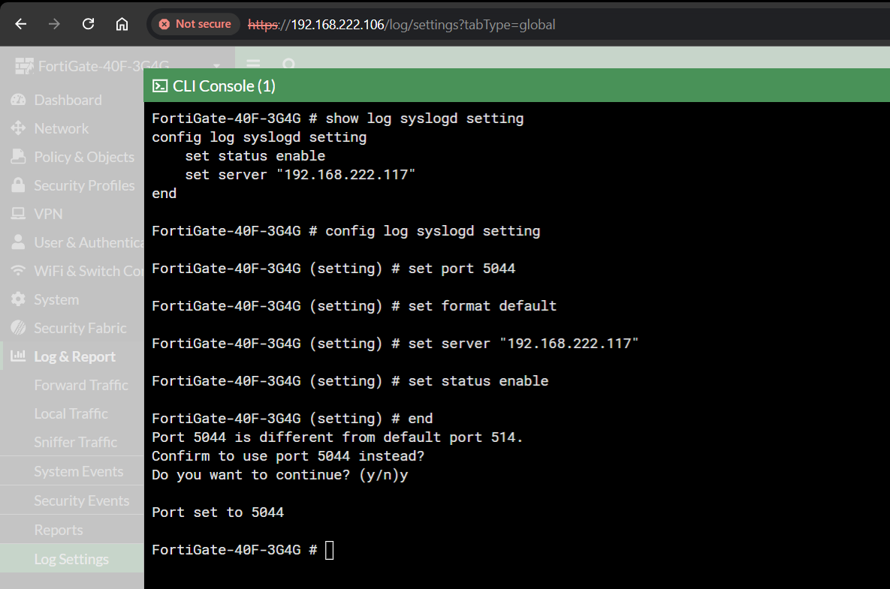

# How to install ?
   #### step 1 install docker and git
   
- sudo apt install docker -y 
- sudo apt install git -y 

#### step 2 clone project to your server

- git clone https://github.com/Taothong98/Logstash_Autodel_in_Docker.git 

#### step 3 run docker in project

- cd Logstash_Autodel_in_Docker
- sudo docker-compose up -d

# Check service
#### You can check whether container start with this command 

- sudo docker ps -a

# Config FortiGate for send log to logstash

